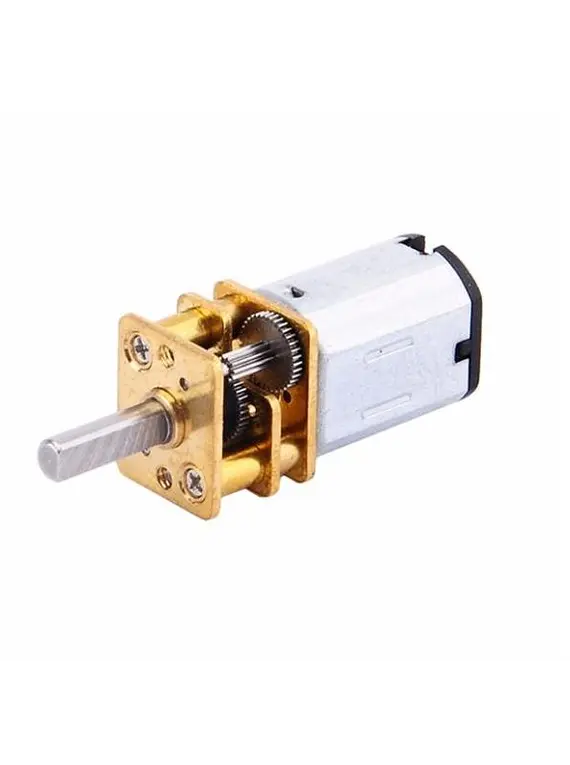
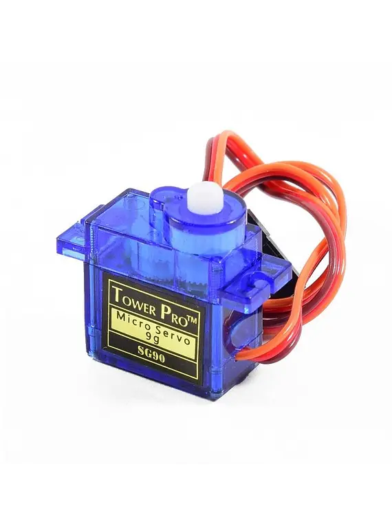
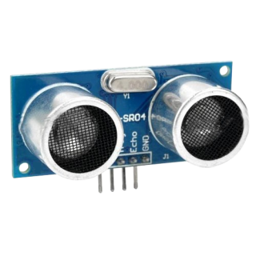
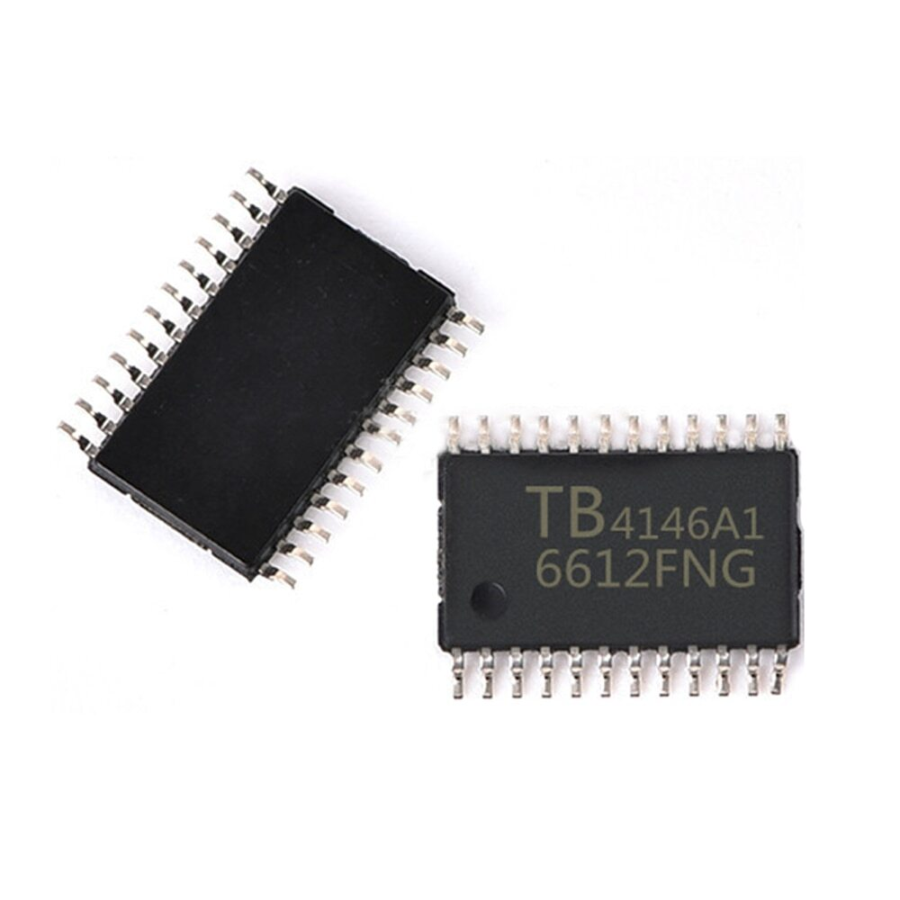
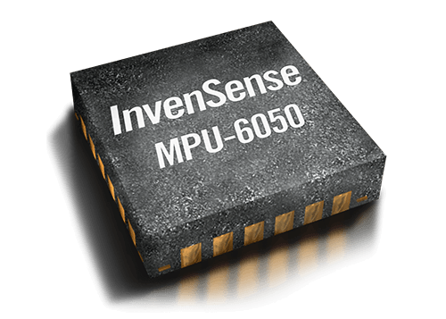
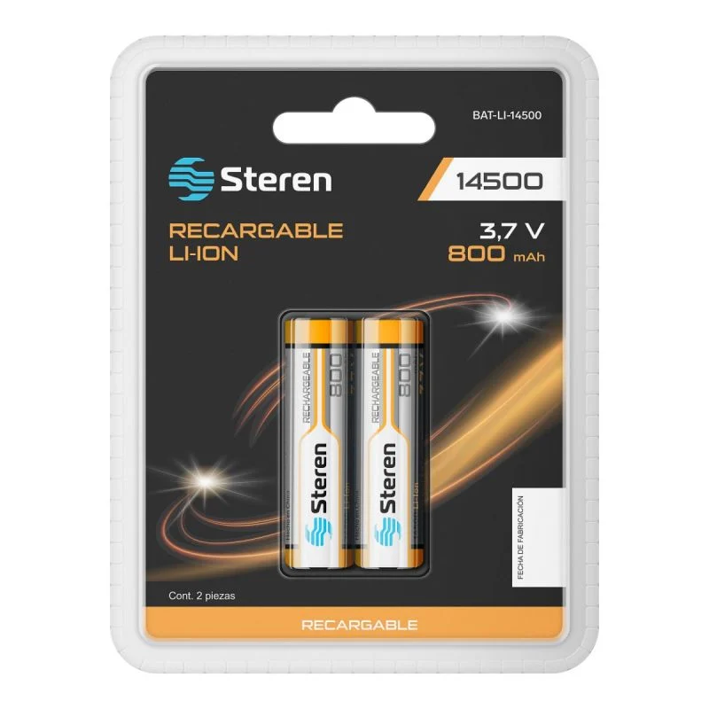

#   D² ROBOTICS TEAM Readme.md   

---

  

  
Welcome to the official repository of Team D2Robotics, a dedicated group of young engineers working to earn the opportunity to represent Panama at the World Robot Olympiad 2025, which will take place in Singapore. We are currently competing in the Future Engineers category and preparing for the national qualifiers with the goal of securing our spot on the international stage.

This repository contains all the code, documentation, and development resources related to our robot project.

---

# 🤖 Team Members

## David Rico

<table>
  <tr>
    <td style="width: 180px; vertical-align: top;">
     
    </td>
    <td style="text-align: justify; padding-left: 20px;">
      

        <strong>- David</strong> is a thoughtful and strategic member of the team who constantly strives to bring people together and keep the project on track. Passionate about baseball and always aiming to win, he brings a sharp mindset to both teamwork and technical challenges—though anime isn't really his thing.
      

      

       <strong>-</strong> In the team, David leads the mechanical and electronic design, creating the robot chassis, 3D-printed parts, and custom PCBs. More than just building, he's responsible for planning the overall robot strategy, ensuring all components work together toward a clear goal. He also contributes significantly to project documentation, helping the team stay organized and aligned throughout the competition.
      

    </td>
  </tr>
</table>

## Davis Peschl
<table>
  <tr>
    <td style="width: 180px; vertical-align: top;">
     
    </td>
    <td style="text-align: justify; padding-left: 20px;">
      

        <strong>- Davis</strong> is a key problem-solver on the team, known for his strong logical thinking and focus on efficient solutions. He plays a central role in the programming of the robot and is responsible for defining the logical strategy that guides its behavior during the competition.
      

      

       <strong>- Davis</strong> also leads the selection and integration of sensors, ensuring the robot can perceive and react to its environment accurately. In addition to his software contributions, he supports the team in the design of PCBs, as well as in the development of both electrical and mechanical components, making him a versatile and essential part of the team.
      

    </td>
  </tr>
</table>

#  📁 Repository Structure

- [📦 ](./MODEL) `MODEL`– Find all the **3D printable parts** of our robot here.    
- [🧠 ](./SRC) `SRC`– Dive into **some of the core code** that powers our robot.
- [📊 ](./SCHEMES)`SCHEMES` – Check out the **circuit diagrams** and wiring plans.
- [📸 ](./V-PHOTOS)`V-PHOTOS` – Browse through **photos of the robot**. 
- [😵 ](./T-PHOTOS)`T-PHOTOS` – All photos of the team (A rare look at **Davis under pressure** 😅???)  
- [🎥](./VIDEO) `VIDEO` – Watch the **robot in action** in our demo video.
- [📂](./OTHERS) `OTHERS` – Extra files and assets used in the development process.

# 🔧 Robot Components
Below is a complete breakdown of the electrical components that bring our robot to life. Every wire, sensor, and structural piece plays a key role in ensuring performance, precision, and reliability during competition.

From custom-designed PCBs to 3D-printed parts and high-performance sensors, this list captures the core of what makes our robot smart, fast, and competition-ready.

| component | Image | buy link |
|--------------|--------------|--------------|
| Raspberry Pi Pico   |         | [🛒 Buy here!](https://www.amazon.com/dp/B0BDLHMQ9C)\ |
| Raspberry Pi Zero 2w|    | [🛒 Buy here!](https://www.amazon.com/dp/B0DRRRZBMP) |
| Raspberry Pi Camer 3|   | [🛒 Buy here!](https://www.amazon.com/dp/B0C9PYCV9S) |
| N20 Motor           |      | [🛒 Buy here!](https://www.amazon.com/dp/B07FVRTWKV) |
| SG90 Servomotor     |        | [🛒 Buy here!](https://www.amazon.com/dp/B0DRHXGY4X) |
| HC-SR04 Sensor      |   | [🛒 Buy here!](https://www.amazon.com/dp/B0B1MJJLJP) |
| TB6612 Motor Contol |       | [🛒 Buy here!](https://lcsc.com/product-detail/Brushed-DC-Motor-Drivers_TOSHIBA-TB6612FNG-O-C-8-EL_C88224.html) |
| MPU605 Gyroscope    |      | [🛒 Buy here!](https://lcsc.com/product-detail/Attitude-Sensors_TDK-InvenSense-MPU-6050_C24112.html) |
| 3.7v Steren Battery |     | [🛒 Buy here!](https://www.steren.com.pa/bateria-recargable-li-ion-2200-mah-tipo-18650.html) |

> **Note 🔔**  
> For an in-depth look at the circuit diagram, check out the SCHEMES folder by clicking [here](./SCHEMES).

---
# ⚙️ Mobility Management

## 🧭 Direction System - Four Wheels Steering

For the steering system, our decision was based on the requirements of the **Obstacle Challenge**. We anticipated the need for very tight turns, so we opted for **four-wheel steering**. This configuration allows for a greater turning angle and improved precision   when maneuvering.

We use **SG90 servo motors** due to their low cost and minimal power consumption.  

We developed an **independent steering system for each axle** (front and rear), which enables tight maneuvers with the designed configuration and significantly reduces time on the track, as shown in the following image:

Since both axles are steerable, we needed to ensure that the **front axle turns in the opposite direction to the rear axle**, and vice versa.  
To achieve this, we implemented a **basic four-gear system**, as shown in the image below.  
This solution allowed us to complete a fully functional and synchronized steering system for the robot.

  

## 🔧 Traction System – 4WD

For the traction system, we chose a **4WD configuration** (four-wheel drive), also known as a **4x4 system**. We believe this setup is more effective on the track, providing better grip and higher speed.
We use **N20 motors** due to their practicality, speed, and lightweight design. To further enhance performance, we implemented **gears** to increase the robot's speed and a **shaft system** that transmits power to both the front and rear wheels.  
This shaft is connected to a **custom differential**, which allows smoother and more controlled motion during turns by distributing power appropriately, regardless of the steering angle.

Below is an image showcasing the full 4WD setup:

However, having both steering and traction on all four wheels introduced a major challenge:  
**How to maintain traction while the robot is turning**.

To solve this, we designed a **custom differential-like mechanism for each wheel** that allows them to receive power **independently of the steering angle**.  
This system ensures continuous traction even during sharp turns, greatly improving maneuverability and overall stability on the track.

Below, we present an image of the implemented system:

> **Note 🔔**  
> You can view the robot in a **3D environment** [here](./MODEL), or see robot images [here](./V-PHOTOS).

---
# 🔌 Power and Sensor Management

For the power system, we aimed for a reliable and efficient energy supply. To achieve this, we used **two 3.7 V, 2800 mAh lithium batteries connected in series**, which allows us to maintain a stable voltage output over a longer period of time. These batteries supply power to the entire robot.

A **boost converter** steps up the voltage to a constant **5 V**, which powers:
- The **Raspberry Pi Pico**
- The **Raspberry Pi Zero 2W**
- The **drive and steering motors**

The **analog voltage output from the Raspberry Pi Pico** is used to power:
- **Ultrasonic sensors**
- **MPU6050 IMU**

The **TB6612 motor driver** requires two voltage levels:
- A **3.3 V logic level** from the Raspberry Pi Pico
- A **12 V supply** (boosted from the batteries) to power the motors

The **camera module** is connected directly to the Raspberry Pi Zero 2W via its CSI interface.

Due to the complexity of the wiring, we designed a **custom PCB**, which we had professionally manufactured in China. This resulted in a **clean, reliable, and fully functional** system with minimal cables.

---
# Obstacle Mangemet

---
# Performance Video

  
  

  
