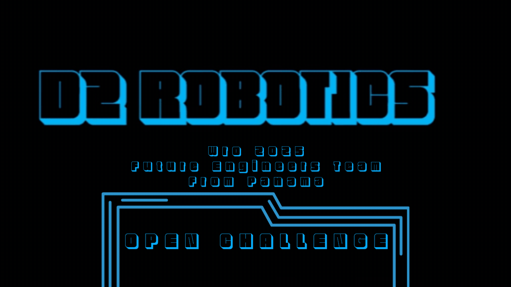
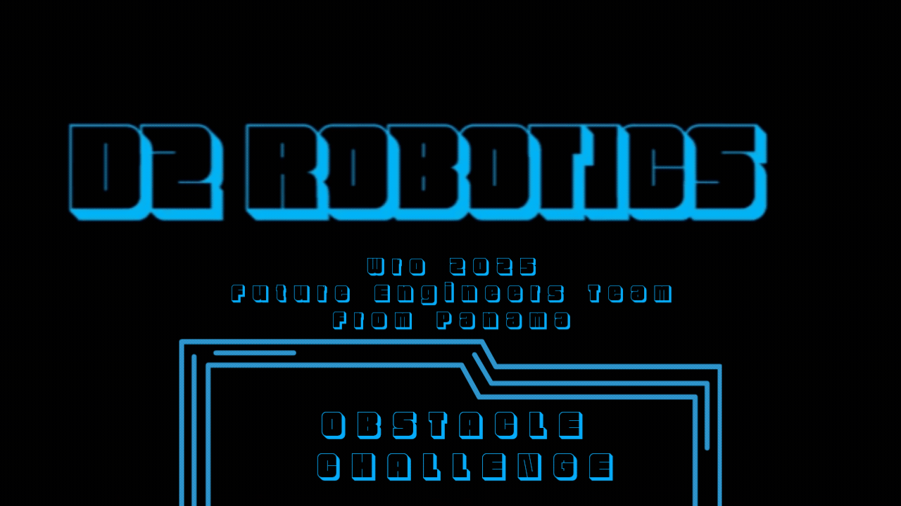

#   D² ROBOTICS TEAM Readme.md   

---
<p align="center">
  
</p>
<div align="justify">
  
[](https://www.youtube.com/@Dravex_18)


Welcome to the official repository of Team D2Robotics, a dedicated group of young engineers working to earn the opportunity to represent Panama at the World Robot Olympiad 2025, which will take place in Singapore. We are currently competing in the Future Engineers category and preparing for the national qualifiers with the goal of securing our spot on the international stage.

This repository contains all the code, documentation, and development resources related to our robot project.
</div>

---

# 🤖 Team Members

## David Rico

<table>
  <tr>
    <td style="width: 180px; vertical-align: top;">
     
    </td>
    <td style="text-align: justify; padding-left: 20px;">
      <p>
        <strong>- David</strong> is a thoughtful and strategic member of the team who constantly strives to bring people together and keep the project on track. Passionate about baseball and always aiming to win, he brings a sharp mindset to both teamwork and technical challenges—though anime isn't really his thing.
      </p>
      <p>
       <strong>-</strong> In the team, David leads the mechanical and electronic design, creating the robot chassis, 3D-printed parts, and custom PCBs. More than just building, he's responsible for planning the overall robot strategy, ensuring all components work together towards a clear goal. He also contributes significantly to project documentation, helping the team stay organized and aligned throughout the competition.
      </p>
    </td>
  </tr>
</table>

## Davis Peschl
<table>
  <tr>
    <td style="width: 180px; vertical-align: top;">
     
    </td>
    <td style="text-align: justify; padding-left: 20px;">
      <p>
        <strong>- Davis</strong> is a key problem-solver on the team, known for his strong logical thinking and focus on efficient solutions. He plays a central role in the programming of the robot and is responsible for defining the logical strategy that guides its behavior during the competition.
      </p>
      <p>
       <strong>- Davis</strong> also leads the selection and integration of sensors, ensuring the robot can perceive and react to its environment accurately. In addition to his software contributions, he supports the team in the design of PCBs, as well as in the development of both electrical and mechanical components, making him a versatile and essential part of the team.
      </p>
    </td>
  </tr>
</table>

<div align="justify">

#  📁 Repository Structure

- [📦 ](./MODEL) `MODEL`– Find all the **3D printable parts** of our robot here.    
- [🧠 ](./SRC) `SRC`– Dive into **some of the core code** that powers our robot.
- [📊 ](./SCHEMES)`SCHEMES` – Check out the **circuit diagrams** and wiring plans.
- [📸 ](./V-PHOTOS)`V-PHOTOS` – Browse through **photos of the robot**. 
- [😵 ](./T-PHOTOS)`T-PHOTOS` – All photos of the team (A rare look at **Davis under pressure** 😅???)  
- [🎥](./VIDEO) `VIDEO` – Watch the **robot in action** in our demo video.
- [📂](./OTHERS) `OTHERS` – Extra files and assets used in the development process.

> # **Note 🔔**  
> ## Please review each folder, as it contains important information that complements the project.


# 🔧 Robot Components
Below is a complete breakdown of the electrical components that bring our robot to life. Every wire, sensor, and structural piece plays a key role in ensuring performance, precision, and reliability during competition.

From custom-designed PCBs to 3D-printed parts and high-performance sensors, this list captures the core of what makes our robot smart, fast, and competition-ready.


<table align="center">
  <!-- Row group 1: Raspberry Pi components -->
  <tr>
    <td align="center"><strong>Raspberry Pi Pico</strong></td>
    <td align="center"><strong>Raspberry Pi Zero 2W</strong></td>
    <td align="center"><strong>Raspberry Pi Camera 3</strong></td>
  </tr>
  <tr>
    <td align="center"></td>
    <td align="center"></td>
    <td align="center"></td>
  </tr>
  <tr>
    <td align="center"><a href="https://www.amazon.com/dp/B0BDLHMQ9C">🛒 Buy here!</a></td>
    <td align="center"><a href="https://www.amazon.com/dp/B0DRRRZBMP">🛒 Buy here!</a></td>
    <td align="center"><a href="https://www.amazon.com/dp/B0C9PYCV9S">🛒 Buy here!</a></td>
  </tr>

  <!-- Row group 2: Motors & sensor -->
  <tr>
    <td align="center"><strong>N20 Motor</strong></td>
    <td align="center"><strong>SG90 Servomotor</strong></td>
    <td align="center"><strong>HC‑SR04 Sensor</strong></td>
  </tr>
  <tr>
    <td align="center"></td>
    <td align="center"></td>
    <td align="center"></td>
  </tr>
  <tr>
    <td align="center"><a href="https://www.amazon.com/dp/B07FVRTWKV">🛒 Buy here!</a></td>
    <td align="center"><a href="https://www.amazon.com/dp/B0DRHXGY4X">🛒 Buy here!</a></td>
    <td align="center"><a href="https://www.amazon.com/dp/B0B1MJJLJP">🛒 Buy here!</a></td>
  </tr>

  <!-- Row group 3: Drivers & battery -->
  <tr>
    <td align="center"><strong>TB6612 Motor Driver</strong></td>
    <td align="center"><strong>MPU6050 Gyroscope</strong></td>
    <td align="center"><strong>3.7 V Steren Battery</strong></td>
  </tr>
  <tr>
    <td align="center"></td>
    <td align="center"></td>
    <td align="center"></td>
  </tr>
  <tr>
    <td align="center"><a href="https://lcsc.com/product-detail/Brushed-DC-Motor-Drivers_TOSHIBA-TB6612FNG-O-C-8-EL_C88224.html">🛒 Buy here!</a></td>
    <td align="center"><a href="https://lcsc.com/product-detail/Attitude-Sensors_TDK-InvenSense-MPU-6050_C24112.html">🛒 Buy here!</a></td>
    <td align="center"><a href="https://www.steren.com.pa/bateria-recargable-li-ion-2200-mah-tipo-18650.html">🛒 Buy here!</a></td>
  </tr>
</table>


> **Note 🔔**  
> For an in-depth look at the circuit diagram, check out the SCHEMES folder by clicking [here](./SCHEMES).


---
# ⚙️ Mobility Management

## 🧭 Direction System - Four Wheels Steering

For the steering system, our decision was based on the requirements of the **Obstacle Challenge**. We anticipated the need for very tight turns, so we opted for **four-wheel steering**. This configuration allows for a greater turning angle and improved precision   when maneuvering.

We use **SG90 servo motors** due to their low cost and minimal power consumption.  

We developed an **independent steering system for each axle** (front and rear), which enables tight maneuvers with the designed configuration and significantly reduces time on the track, as shown in the following image:

<div align="center">


</div>

Since both axles are steerable, we needed to ensure that the **front axle turns in the opposite direction to the rear axle**, and vice versa.  
To achieve this, we implemented a **basic four-gear system**, as shown in the image below.  
This solution allowed us to complete a fully functional and synchronized steering system for the robot.

<div align="center">

  

</div>


## 🔧 Traction System – 4WD

For the traction system, we chose a **4WD configuration** (four-wheel drive), also known as a **4x4 system**. We believe this setup is more effective on the track, providing better grip and higher speed.
We use **N20 motors** due to their practicality, speed, and lightweight design. To further enhance performance, we implemented **gears** to increase the robot's speed and a **shaft system** that transmits power to both the front and rear wheels.  
This shaft is connected to a **custom differential**, which allows smoother and more controlled motion during turns by distributing power appropriately, regardless of the steering angle.

Below is an image showcasing the full 4WD setup:

<div align="center">


</div>

However, having both steering and traction on all four wheels introduced a major challenge:  
**How to maintain traction while the robot is turning**.

To solve this, we designed a **custom differential-like mechanism for each wheel** that allows them to receive power **independently of the steering angle**.  
This system ensures continuous traction even during sharp turns, greatly improving maneuverability and overall stability on the track.

Below, we present an image of the implemented system:

<div align="center">


</div>

> **Note 🔔**  
> You can view the robot in a **3D environment** [here](./MODEL), or see robot images [here](./V-PHOTOS).

---

# 🔌 Power Management

We designed the power system to be both reliable and efficient. The robot is powered by two 3.7 V, 2800 mAh li-on batteries connected in series, providing a stable voltage and sufficient capacity for extended operation.
A boost converter increases the voltage to a constant 5 V, which supplies power to:

-	The Raspberry Pi Pico
-	The Raspberry Pi Zero 2W
-	The drive and steering motors
  
Additionally, the TB6612 motor driver requires:

-	A 3.3 V logic signal from the Raspberry Pi Pico
-	A 12 V power supply, also boosted from the batteries
  
To simplify wiring and ensure a clean layout, we designed a custom PCB, professionally manufactured in China. This approach minimized cabling and improved system reliability.

# 📡 Sensing System

The sensing system includes a variety of modules that allow the robot to perceive and respond to its environment with accuracy. These components are powered through regulated outputs from the microcontroller.
The 3.3 V output from the Raspberry Pi Pico powers:

- Ultrasonic sensors (HC-SR04) : Used to measure the distance to the wall and determine the appropriate setpoint the robot must maintain during operation.

-	MPU6050 Inertial Measurement Unit (IMU): Used to maintain a constant heading and estimate the robot’s displacement along the track.
  
The camera module (Raspberry Pi Camera 3) connects directly to the Raspberry Pi Zero 2W via its CSI interface, handling visual input for navigation or object detection.

This configuration ensures that all sensing elements operate consistently and efficiently, supporting the robot's autonomous capabilities.


---
# 🛣️ Open Challenge

## First Round 

For the first round, we focused on achieving precise turns and exceptional corrections.
Since the initial position and orientation of the robot were unknown, we opted for a path that stayed as close as possible to the outer wall, minimizing the chance of hitting internal obstacles.

Our strategy was centered on curve handling.
We designed a sequence of steps to determine the appropriate turning radius and travel distance.
Initially, we planned to use a front-facing ultrasonic sensor to detect the distance to an upcoming curve.
However, we realized we could calculate the robot’s displacement with high precision using other methods.
By combining these elements, the robot was able to navigate curves accurately and reliably.

Here is a diagram illustrating the sequence of steps used:

📊 [Insert curve-handling diagram here]

In the section we called the "hallway", we used two key points as references to the outer wall.
This allowed us to refine our localization and improve control accuracy.

Once the robot completed 11 full sections, the program automatically recognized this and returned to the starting position, ending the round.

<details>
<summary>🛣️ Open Challenge Code (CLICK HER TO OPEN IT!)</summary>

# 🚀 OPEN CHALLENGE CODE

For the development of the control system, careful planning of the challenge stages—previously explained in the Obstacle Management section—was essential.
Given the need for full control over the robot’s behavior, we designed and implemented custom libraries, each responsible for a specific subsystem such as:

- Distance measurement

- PID control

- Camera vision

- Counters and timers

- And other essential functionalities

This modular structure allowed for a more organized and scalable codebase, reducing development time and improving maintainability.

As the first step in our code, we import all the necessary libraries:


<details open>
<summary>⚙️ Libraries</summary>

```cpp
#include <Arduino.h>
#include <Bounce2.h>
#include "Robot.h"
#include "PID.h"
#include <math.h>
``` 
</details>

> **Note 🔔**  
> Variables and constants are declared within their respective librarie

We then initialize the serial interface and call setup functions defined inside our custom libraries:

<details open>
<summary>⚙️ SETUP</summary>

```cpp
  
 ```cpp
  void setup() {
  Serial.begin(115200);
  myRobot.begin();

  pinMode(builtinLed, OUTPUT);
  pinMode(LED, OUTPUT);
  digitalWrite(builtinLed, HIGH);

  button.attach(buttonPin, INPUT_PULLUP);
  button.interval(50);
}

```
</details>

Finally, the main loop is responsible for the robot's high-level behavior, including angle estimation, position updates, distance readings, and PID-based control.

The logic is structured in four main steps, allowing the robot to progress through defined stages of the challenge.

<details open>
<summary>⚙️ LOOP </summary>


```cpp
void loop() {
  //Start
  button.update();
  if (button.fell() && !activo) {
    activo = true;
    digitalWrite(builtinLed, LOW);
    myRobot.setSteerAngle(0);
    delay(1000);
  }
  if (!activo || terminado) return;

 //-----------------------------------------

  if (step==0){
    if (!stepActivaded[step]){
        myRobot.setForceTriggerF(true);
        myRobot.setForceTriggerO(true);
        myRobot.setForceTriggerI(true);
        myRobot.setDriveSpeed(0.4);
        delay(200);
        setpoint=0.5;
        myRobot.setPoseX(0.5);  //Ronda 1, se puede cambiar por una lectura con el sensor ultrasonico
        myRobot.setPoseY(1.4+0.4*0.2);  
        stepActivaded[step]=true;
    }
    //out
    if(myRobot.getPose('y')>=2){
      step++;
    }
    
  }

  myRobot.listenEcho();
  myRobot.updatePose();
  if (pid.isEnabled()){ pwm = pid.compute(setpoint, myRobot.getPose('x')); }
  myRobot.setServoPWM(pwm);
  myRobot.simulateContinuousServo();

  if (step==1){ 
    if (!stepActivaded[step]){
    //Aqui se puede agregar al despues
    }
      

    if (myRobot.getDist('f')>0.2 && myRobot.getDist('f')<0.8 && dirr==0){  //esto se puede reemplazar por myrobotgetpose y
      dirr = (myRobot.getDist('o') < 1) ? 1 : -1;

    }


    //out
    if (dirr!=0 && myRobot.getDist('f')<0.65){ //el cornering toma 0.35m y se quiere que el setpoint este a 0.3,por lo que 0.35+0.3=0.65 //esto se puede reemplazar por myrobotgetpose y
      
      myRobot.setPoseX(myRobot.getDist('f'));

      if (dirr==1){
        myRobot.setPoseY(myRobot.getPose('x'));
        myRobot.setPoseH(-90 + myRobot.getPose('h')) ; //aqui tengo que ver que pex
      }
      
      else{
        myRobot.setPoseY(1-myRobot.getPose('x'));
        myRobot.setPoseH(-90 - myRobot.getPose('h'));  //aqui tengo que ver que pex
      }
      myRobot.setDIR(dirr);
      pid.disable();
      pid.setDIR(dirr);
      step++;

    } 
  }
  

  if (step==2){
    if (!stepActivaded[step]){
    stepActivaded[step]=true;
    }

    //out
    if(myRobot.getPose('h')>-5){
      myRobot.setPoseX(myRobot.getDist('o'));
      step++;
    }
    else {
      myRobot.setSteerAngle(dirr == 1 ? -10 : -12);//esto no es lo ideal, esto se debe a un problema con la direccion
    }
  }

  if (step==3){
    if (!stepActivaded[step]){
      digitalWrite(LED, LOW);
      setpoint=0.3;
      //myRobot.setDriveSpeed(0.0);
      //myRobot.setSteerAngle(0);
      //delay(500);
      //myRobot.setDriveSpeed(0.4);
      pid.reset();
      pid.enable();
      stepActivaded[step]=true;
    }

    // Captura primer punto
    if (myRobot.getPose('y') > 1.1 && !x1_capturado) {
      digitalWrite(LED, HIGH);
      temp_x1 = myRobot.getDist('o');
      temp_y1 = myRobot.getPose('y');
      x1_capturado = true;
    }

    // Captura segundo punto
    if (myRobot.getPose('y') > 1.2 && !x2_capturado) {
      digitalWrite(LED, LOW);
      temp_x2 = myRobot.getDist('o');
      temp_y2 = myRobot.getPose('y');
      x2_capturado = true;

      float dx = temp_x2 - temp_x1;
      float dy = temp_y2 - temp_y1;

      float angulo_rad = atan2(dx, dy);
      float angulo_deg = angulo_rad * 180.0 / PI;

      myRobot.setPoseX(temp_x2);
      myRobot.setPoseH(angulo_deg);

    }
    

    //out
    if (myRobot.getPose('y')>2 ){
      //x1_capturado = false;
      //x2_capturado = false;
      stepActivaded[2]=false;
      stepActivaded[3]=false;
      step=1;
    }

  }

  if (step==6){

    
    myRobot.setDriveSpeed(0.0);
    myRobot.setServoPWM(0);
/*
    int divisor = round(myRobot.getPose('y') / 0.1);
    for (int i = 0; i < divisor; i++) {
    digitalWrite(LED, HIGH);
    delay(500);
    digitalWrite(LED, LOW);
    delay(500);
  }
  */
    terminado = true;
  }

}


```
</details>

</details>

---

## 🏁 Second Round


For the second round, we used the same steering system as in the first round, with a few critical modifications.

Because the robot now starts from a designated parking zone, we leveraged the initial ultrasonic distance readings to determine the robot’s orientation and movement direction from the very beginning.

After this, the track was divided into distinct lanes for better control and logic structuring.

📊 [Insert "Exit from Parking" Diagram Here]

Another key change involves curve handling. The set of target points used by the robot to follow a curve now varies depending on the lane it is in.

This allowed us to create a lane-specific curve model, enabling the robot to detect all blocks across the track with minimal blind spots.

This entire process repeats until the robot completes three full laps.

After the final lap, the robot begins detecting the magenta color of the parking zone and finishes the round by aligning itself in parallel with the parking area.


<details>
<summary>  🛣️ Obstacle Challenge Code (CLICK HER TO OPEN IT!)</summary>

# 🧱 OBSTACLE CHALLENGE

For the obstacle challenge round, we used the same mobility system as in the first round. The only difference is that we activated the camera to detect and classify obstacles.

As the first step, we import the necessary libraries.

Due to the orientation of our robot, we inverted the captured image to correct its alignment.

Additionally, we reduced the camera resolution (i.e., pixel count) to speed up image processing and enable faster response times.

<details open>
<summary> ⚙️ CONFIGURATION </summary>


```cpp
from picamera2 import Picamera2
import cv2
from datetime import datetime
import numpy as np
import serial

picam2 = Picamera2()
picam2.start()
ser = serial.Serial('/dev/ttyACM0', 115200, timeout=1)
#mask_actual = masks["i"]

----------------------------------------

frame = picam2.capture_array()
frame = cv2.cvtColor(frame, cv2.COLOR_RGB2BGR)
frame_real = cv2.flip(frame, 0)  #rotamos la camara verticalmente
frame_reducido = cv2.resize(frame_real, (0, 0), fx=0.2, fy=0.2) #redimenzionando la imagen
    

``` 
</details>


We implemented a mask-based detection system using OpenCV, coded in Python and running on the Raspberry Pi Zero 2W.

This method allows us to calculate the average RGB color within a specified region of the image.

The result is then compared to a set of predefined thresholds to determine whether or not a block is present in that region.
<details open>
<summary>⚙️ MASK DECLARATION </summary>


```cpp
masks = {
    "bd": ([80, 15], [120, 15], [120, 85], [80, 85]),
    "bi": ([7, 15], [45, 15], [45, 85], [7, 85]),
    "bcc": ([7, 15], [120, 15], [120, 85], [80, 85]),
    "bcle": ([7, 15], [120, 15], [120, 85], [80, 85]),
    "lcd": ([15, 0], [0, 15], [110, 95], [125, 80]),
    "lci": ([110, 0], [125, 15], [15, 95], [0, 80]),
    "i": ([0, 0], [125, 125], [95, 95], [80, 80]),
}
mask_actual = masks["i"]

``` 
</details>

> **Note 🔔**  
> The "i" mask is used as the default region and does not correspond to a specific detection zone.

According to our strategy, the robot must know which region to analyze at each stage of the challenge.

To accomplish this, the main Raspberry Pi Pico sends a request to the Raspberry Pi Zero 2W specifying the region to measure.

The Zero 2W then processes that region and sends back the result via serial communication.

<details open>
<summary>⚙️ UART COMUNICATION </summary>
  
```cpp
 if ser.in_waiting > 0:
        mensaje = ser.readline().decode().strip()
        print("Dato recibido:", mensaje)
        if mensaje in masks:
            mask_actual = masks[mensaje]
----------------------------------------------------
 # Enviar el color por serial
    ser.write(f"{color}\n".encode())

``` 
</details>

</details>

---

# 🎥 Performance Video

This video demonstrates the complete performance of our robot during the competition.
It showcases the execution of key functionalities such as:

- Precise lane tracking and curve navigation

- Obstacle avoidance using sensor feedback

- Dynamic path correction based on environment inputs

- Color detection 

📽️ Watch the videos by clicking ten images or you can visit our youtube channel  [](https://www.youtube.com/@Dravex_18) >

<table align="center">
  <tr>
    <th align="center">OPEN CHALLENGE</th>
    <th align="center">OBSTACLE CHALLENGE</th>
  </tr>
  <tr>
    <td align="center">
      <a href="https://www.youtube.com/watch?v=Ml1ZyXK22XI" target="_blank">
        
      </a>
    </td>
    <td align="center">
      <a href="https://www.youtube.com/watch?v=BL7dXvtKBQE" target="_blank">
        
      </a>
    </td>
  </tr>
</table>

