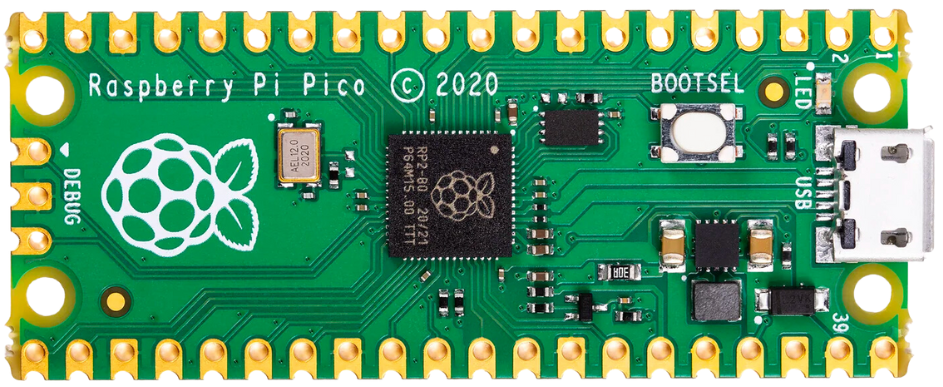
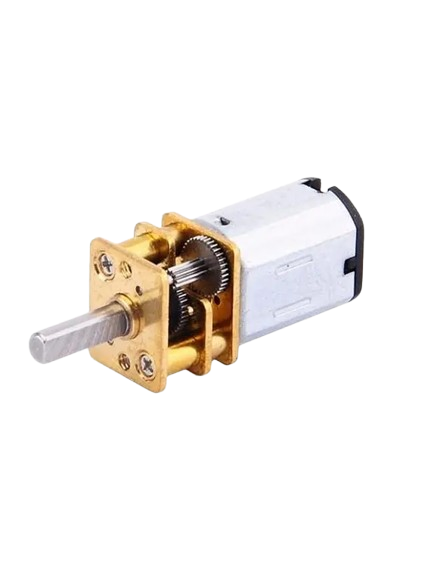
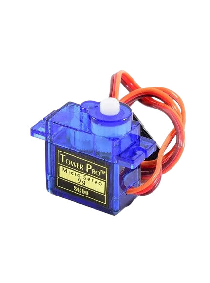
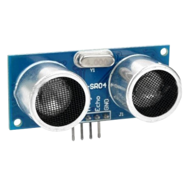
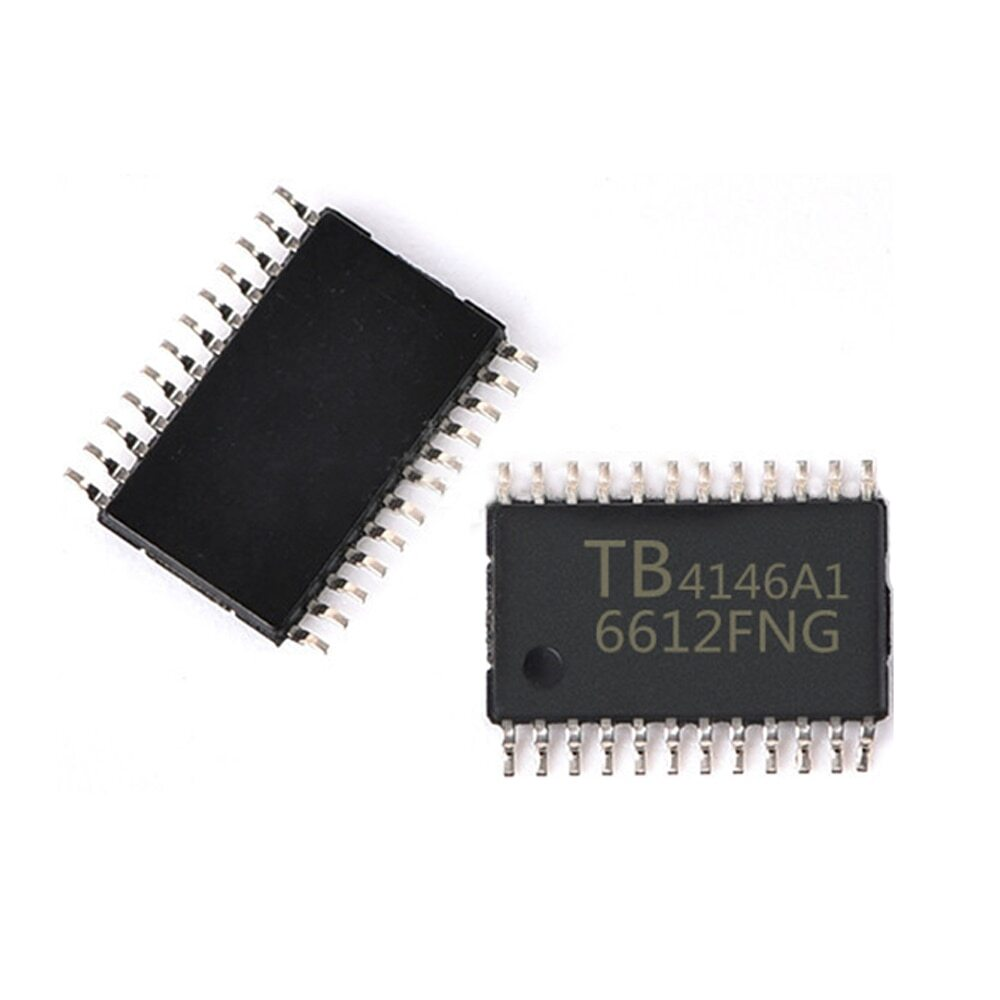
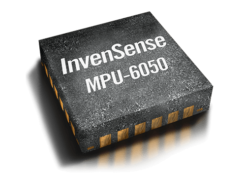
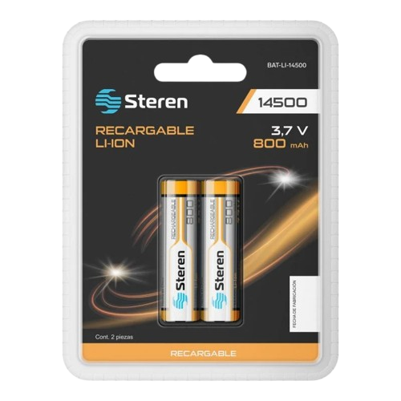

#   D² ROBOTICS TEAM Readme.md   

---

  

  

Welcome to the official repository of Team D2Robotics, a dedicated group of young engineers working to earn the opportunity to represent Panama at the World Robot Olympiad 2025, which will take place in Singapore. We are currently competing in the Future Engineers category and preparing for the national qualifiers with the goal of securing our spot on the international stage.

This repository contains all the code, documentation, and development resources related to our robot project.

---

# 🤖 Team Members

## David Rico

<table>
  <tr>
    <td style="width: 180px; vertical-align: top;">
     
    </td>
    <td style="text-align: justify; padding-left: 20px;">
      

        <strong>- David</strong> is a thoughtful and strategic member of the team who constantly strives to bring people together and keep the project on track. Passionate about baseball and always aiming to win, he brings a sharp mindset to both teamwork and technical challenges—though anime isn't really his thing.
      

      

       <strong>-</strong> In the team, David leads the selection and integration of sensors, ensuring that the robot can perceive and respond to its environment with high accuracy. He was also responsible for the computer vision system, playing a fundamental role in the success of the project. Beyond his software contributions, he supports the team in PCB design and in the development of both electrical and mechanical components, making him a versatile and indispensable member of the team.
      

    </td>
  </tr>
</table>

## Davis Peschl
<table>
  <tr>
    <td style="width: 180px; vertical-align: top;">
     
    </td>
    <td style="text-align: justify; padding-left: 20px;">
      

        <strong>- Davis</strong> is a key problem-solver on the team, known for his strong logical thinking and focus on efficient solutions. He plays a central role in the programming of the robot and is responsible for defining the logical strategy that guides its behavior during the competition.
      

      

       <strong>-</strong> In the team, Davis leads the mechanical and electronic design, developing the robot chassis, 3D-printed components, and custom PCBs. Beyond fabrication, he is responsible for planning the overall robot strategy, ensuring that all subsystems operate cohesively toward a defined objective. In addition to his strategic contributions, Davis provided technical expertise and optimization across multiple aspects of the project, strengthening both performance and reliability.
      

    </td>
  </tr>
</table>

#  📁 Repository Structure

- [📦 ](./MODEL) `MODEL`– Find all the **3D printable parts** of our robot here.    
- [🧠 ](./SRC) `SRC`– Dive into **some of the core code** that powers our robot.
- [📊 ](./SCHEMES)`SCHEMES` – Check out the **circuit diagrams** and wiring plans.
- [📸 ](./V-PHOTOS)`V-PHOTOS` – Browse through **photos of the robot**. 
- [😵 ](./T-PHOTOS)`T-PHOTOS` – All photos of the team (A rare look at **Davis under pressure** 😅???)  
- [🎥](./VIDEO) `VIDEO` – Watch the **robot in action** in our demo videos.
- [📂](./OTHERS) `OTHERS` – Extra files and assets used in the development process.

# 🔧 Robot Components
Below is a complete breakdown of the electrical components that bring our robot to life. Every wire, sensor, and structural piece plays a key role in ensuring performance, precision, and reliability during competition.

From custom-designed PCBs to 3D-printed parts and high-performance sensors, this list captures the core of what makes our robot smart, fast, and competition-ready.

<table align="center">
  <!-- Row group 1: Raspberry Pi components -->
  <tr>
    <td align="center"><strong>Raspberry Pi Pico</strong></td>
    <td align="center"><strong>Raspberry Pi Zero 2W</strong></td>
    <td align="center"><strong>Raspberry Pi Camera 3 Wide</strong></td>
  </tr>
  <tr>
    <td align="center"></td>
    <td align="center"></td>
    <td align="center"></td>
  </tr>
  <tr>
    <td align="center"><a href="https://www.amazon.com/dp/B0BDLHMQ9C">🛒 Buy here!</a></td>
    <td align="center"><a href="https://www.amazon.com/dp/B0DRRRZBMP">🛒 Buy here!</a></td>
    <td align="center"><a href="https://www.amazon.com/dp/B0C9PYCV9S">🛒 Buy here!</a></td>
  </tr>

  <!-- Row group 2: Motors & sensor -->
  <tr>
    <td align="center"><strong>N20 Motor</strong></td>
    <td align="center"><strong>SG90 Servomotor</strong></td>
    <td align="center"><strong>HC‑SR04 Sensor</strong></td>
  </tr>
  <tr>
    <td align="center"></td>
    <td align="center"></td>
    <td align="center"></td>
  </tr>
  <tr>
    <td align="center"><a href="https://www.amazon.com/dp/B07FVRTWKV">🛒 Buy here!</a></td>
    <td align="center"><a href="https://www.amazon.com/dp/B0DRHXGY4X">🛒 Buy here!</a></td>
    <td align="center"><a href="https://www.amazon.com/dp/B0B1MJJLJP">🛒 Buy here!</a></td>
  </tr>

  <!-- Row group 3: Drivers & battery -->
  <tr>
    <td align="center"><strong>TB6612 Motor Driver</strong></td>
    <td align="center"><strong>MPU6050 Gyroscope</strong></td>
    <td align="center"><strong>3.7 V Steren Battery</strong></td>
  </tr>
  <tr>
    <td align="center"></td>
    <td align="center"></td>
    <td align="center"></td>
  </tr>
  <tr>
    <td align="center"><a href="https://lcsc.com/product-detail/Brushed-DC-Motor-Drivers_TOSHIBA-TB6612FNG-O-C-8-EL_C88224.html">🛒 Buy here!</a></td>
    <td align="center"><a href="https://lcsc.com/product-detail/Attitude-Sensors_TDK-InvenSense-MPU-6050_C24112.html">🛒 Buy here!</a></td>
    <td align="center"><a href="https://www.steren.com.pa/bateria-recargable-li-ion-2200-mah-tipo-18650.html">🛒 Buy here!</a></td>
  </tr>
</table>

> **Note 🔔**  
> For an in-depth look at the circuit diagram, check out the SCHEMES folder by clicking [here](./SCHEMES).

---
# ⚙️ Mobility Management

## 🧭 Direction System - Four Wheels Steering

For the steering system, our decision was based on the requirements of the **Obstacle Challenge**. We anticipated the need for very tight turns, so we opted for **four-wheel steering**. This configuration allows for a greater turning angle and improved precision   when maneuvering.

We use **SG90 servo motors** due to their low cost and minimal power consumption.  

We developed an **independent steering system for each axle** (front and rear), which enables tight maneuvers with the designed configuration and significantly reduces time on the track, as shown in the following image:

Since both axles are steerable, we needed to ensure that the **front axle turns in the opposite direction to the rear axle**, and vice versa.  
To achieve this, we implemented a **basic four-gear system**, as shown in the image below.  
This solution allowed us to complete a fully functional and synchronized steering system for the robot.

  

## 🔧 Traction System – 4WD

For the traction system, we chose a **4WD configuration** (four-wheel drive), also known as a **4x4 system**. We believe this setup is more effective on the track, providing better grip and higher speed.
We use **N20 motors** due to their practicality, speed, and lightweight design. To further enhance performance, we implemented **gears** to increase the robot's speed and a **shaft system** that transmits power to both the front and rear wheels.  
This shaft is connected to a **custom differential**, which allows smoother and more controlled motion during turns by distributing power appropriately, regardless of the steering angle.

Below is an image showcasing the full 4WD setup:

However, having both steering and traction on all four wheels introduced a major challenge:  
**How to maintain traction while the robot is turning**.

To solve this, we designed a **custom differential-like mechanism for each wheel** that allows them to receive power **independently of the steering angle**.  
This system ensures continuous traction even during sharp turns, greatly improving maneuverability and overall stability on the track.

Below, we present an image of the implemented system:

> **Note 🔔**  
> We encourage you to visit the `MODEL` older, where you can download the robot’s 3D design by clicking here [here](./MODEL),, and check the `V-PHOTOS` folder to view images of the robot [here](./V-PHOTOS).

---

# 🔌 Power Management

We designed the power system to be both reliable and efficient. The robot is powered by two 3.7 V, 2800 mAh li-on batteries connected in series, providing a stable voltage and sufficient capacity for extended operation.
A boost converter increases the voltage to a constant 5 V, which supplies power to:

-	The Raspberry Pi Pico
-	The Raspberry Pi Zero 2W
-	The drive and steering motors
  
Additionally, the TB6612 motor driver requires:

-	A 3.3 V logic signal from the Raspberry Pi Pico
-	A 12 V power supply, also boosted from the batteries
  
To simplify wiring and ensure a clean layout, we designed a custom PCB, professionally manufactured in China. This approach minimized cabling and improved system reliability.

# 📡 Sensing System

The sensing system includes a variety of modules that allow the robot to perceive and respond to its environment with accuracy. These components are powered through regulated outputs from the microcontroller.
The 3.3 V output from the Raspberry Pi Pico powers:

- Ultrasonic sensors (HC-SR04) : Used to measure the distance to the wall and determine the appropriate setpoint the robot must maintain during operation.

-	MPU6050 Inertial Measurement Unit (IMU): Used to maintain a constant heading and estimate the robot’s displacement along the track.
  
The camera module (Raspberry Pi Camera 3) connects directly to the Raspberry Pi Zero 2W via its CSI interface, handling visual input for navigation or object detection.

This configuration ensures that all sensing elements operate consistently and efficiently, supporting the robot's autonomous capabilities.

---
# 🛣️ Rounds Strategy

p<!--
## General information for all rounds

There are several concepts required to understand the operation of our robot; these concepts are mainly applied to the movement and positioning of our robot on the competition track.

- Available distance sensing: Currently, we only use two lateral ultrasonic sensors, whose purpose is to compensate for MPU6050 drift. The GPIOs originally reserved for a front ultrasonic sensor were reassigned to front IR sensors (placed at the edges of the front face) to improve accuracy during entry/positioning in the parking area.

- PID control strategy: Our robot relies on three operating modes.

  - Lateral PID (conventional): Maintains a transversal setpoint (x or y) relative to the circuit’s straight walls. In this context, the offset refers to the distance between the robot and the outer wall, which is kept stable to ensure straight-line motion.

  - Pursuit PID (Pure Pursuit): Controls the angular error toward a target point on a curved trajectory. Here, the angular error corresponds to the inclination of the robot’s front relative to the reference line of the path, ensuring the robot anticipates and smooths turns.

  - Special mode (no lateral PID or pursuit): Used only for parking entry/exit or specific maneuvers, relying exclusively on heading + front IR sensors.
    
> **Note 🔔**  
> Why 2 PIDs instead of 1?
>   - Lateral PID controls the error with respect to a parallel straight line (keeping a stable lateral offset).
>   - Pursuit PID controls the angular error toward a target point on a curved trajectory (anticipating and smoothing turns). 
>     
> A single “generic” PID tends to mix objectives (lateral vs. directional), degrading stability and response time, while forcing contradictory tuning. Keeping them separated ensures stability, clear gain assignment, and better performance.

- State estimation: distance and pose: We rely on two sources.
    - Relative distance/pose (simplified odometry): The PCB integrates an MPU IMU sampling every 10 ms, from which the robot’s orientation angle is obtained through angular velocity integration. Linear velocity is estimated using a simple “power → velocity” lookup table, since no encoders are used. Although the relationship with voltage is non-linear, the system is constrained to 1–2 predefined speed levels to minimize error.
    - Absolute distance/pose (rectification): In predefined sections, where the robot is nearly parallel to the walls, lateral ultrasonic sensors are used to measure and correct accumulated drift (x or y depending on the active axis). In the code, this appears as absolute readings such as `robot.getPoseXFromSensors(setpoint)`, injected after specific events like the end of a turn or the midpoint of a straight.

- Map and setpoint conventions: To simplify both code implementation and internal communication, we defined a set of conventions: the default driving direction is counterclockwise ('A') as a design guideline; the Y-axis runs parallel to the straight walls; and the heading is set to 0° when the robot is aligned parallel to the walls, increasing when turning toward the inner walls and decreasing when turning toward the outer walls.
    - Track zoning: The track is divided into four zones (zone0 … zone3), each with its own predefined paths and associated rules for rectification and camera-based readings.
    - Parallel setpoints (straights): The track is divided into four zones, with the coordinate system defined so that the Y-axis runs parallel to the walls. Two coordinate system schemes are considered: counterclockwise and clockwise. We use typical offsets of 0.2, 0.4, 0.5, and 0.8 meters, plus an auxiliary offset of 0.29 meters for parking and fine-tuning. Four parallel setpoints are defined and represented along the track.

- Paths and the application of Pursuit: The Pursuit PID is used for approximately 15 predefined paths, including 90° turns, alignments, and lane adjustments at the end of straight sections. Both the `lookahead_dist` and the Pursuit gains are adapted depending on the path, for example, path 6 is specifically tuned for 90° turns.
  

  
  

> **Note 🔔**  
> You can dowload yhe pyton fle to create paths by clicking [HERE](./SRC/paths.py)

      
-->

## First Round (Open Challenge)

For the first round, we focused on achieving precise turns and exceptional corrections.
Since the initial position and orientation of the robot were unknown, we opted for a path that stayed as close as possible to the outer wall, minimizing the chance of hitting internal obstacles.

Our strategy was centered on curve handling.
We designed a sequence of steps to determine the appropriate turning radius and travel distance.
Initially, we planned to use a front-facing ultrasonic sensor to detect the distance to an upcoming curve.
However, we realized we could calculate the robot’s displacement with high precision using other methods.
By combining these elements, the robot was able to navigate curves accurately and reliably.

Here is a diagram illustrating the sequence of steps used:

In the section we called the "hallway", we used two key points as references to the outer wall.
This allowed us to refine our localization and improve control accuracy.

Once the robot completed 11 full sections, the program automatically recognized this and returned to the starting position, ending the round.

## 🏁 Second Round (Obstacle Challenge)

 
p<!--
For the obstacle round, precision is prioritized over speed. The first challenge to address was selecting a sensor capable of detecting track colors and a development board powerful enough to process images without adding excessive weight or size. After extensive research, we chose the Pi Camera 3 Wide for image capture. This camera provides a 120° field of view (FOV), allowing for a wider visual range. For processing, we used the Raspberry Pi Zero 2W, a compact computer capable of handling image data quickly and reliably.

### Strategy

To process the images, we decided to use OpenCV, as it provides both flexibility and speed. We divided the field of view into ROIs (Regions of Interest), which adapt depending on the robot’s position and the location of the next block to be detected. This approach allows us to process only the pixels within the relevant region, optimizing efficiency and reducing computational load.

The following image illustrates the regions we used:

As can be observed, when exiting the parking slot there is a special case for each direction. If the direction is clockwise, the robot must process both Region A and Region B. To handle this simultaneously, we implemented multithreading. In total, three threads are used: two dedicated to image capture and one main thread. These threads run concurrently without interfering with one another, making this approach ideal for our situation.

The following diagram illustrates how the threads operate within our code:

  

For color processing, we explored multiple approaches, but the most effective one was color segmentation. First, we capture the image in RGB format to maintain control over parameters such as exposure time. Then, we convert it to HSV format, which is better suited for handling variations in ambient lighting.

In simple terms, color segmentation works by defining specific HSV ranges for each target color. These ranges can be adjusted depending on lighting conditions or saturation levels. Each pixel is checked against the predefined range: if it falls within the range, it is set to 1; otherwise, it is set to 0.

Finally, we count the number of pixels that match the red and green ranges, respectively. These counts are then compared against a minimum threshold established by us. If both exceed the threshold, the color with the greater pixel count is selected.

-->
> **Note 🔔**  
> You can view the complete source code of our project inside the [`SRC` ](https://github.com/Dravex18/D2-Robotics-WRO2025/blob/main/SRC/README.md#L145) folder.

