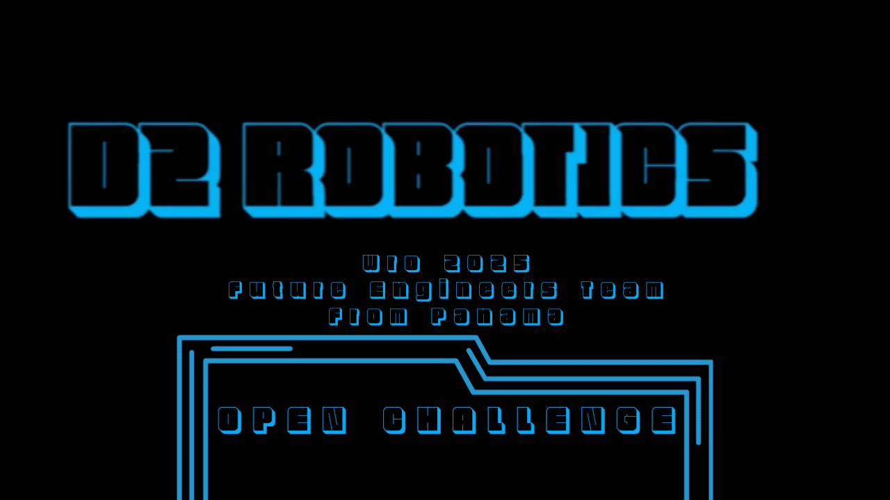

# 🎥 Performance Video

This video demonstrates the complete performance of our robot during the competition.
It showcases the execution of key functionalities such as:

- Precise lane tracking and curve navigation

- Obstacle avoidance using sensor feedback

- Dynamic path correction based on environment inputs

- Color detection 

📽️ Watch the videos:

<table align="center">
  <tr>
    <th align="center">OPEN CHALLENGE</th>
    <th align="center">OBSTACLE CHALLENGE</th>
  </tr>
  <tr>
    <td align="center">
      
    </td>
    <td align="center">
      
    </td>
  </tr>
</table>
